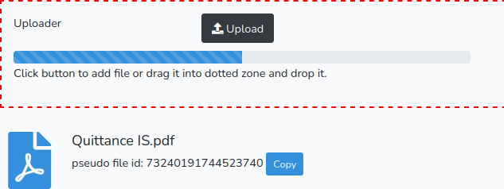

# Uploader

[By Sébastien L'haire](http://sebastien.lhaire.org)

A Laravel library to provide file upload utilities. A Javascript library builds a
  complete file upload widget with upload button, drag-and-drop zone, progress bar
  and result builder. A controller is available to manage uploaded files.

It uses:

* a Javascript table builder based on [jQuery](https://jquery.com/) Javascript framework.
* [Bootstrap](https://getbootstrap.com/) 5 CSS Framework.
* [FontAwesome](https://fontawesome.com/) icons



Demo site available [here](https://sebastien.lhaire.org/uploader).

## Installation

1. `composer require seblhaire/uploader`

2. Composer will automatically link the package with Laravel. But you still can explicitely add provider and facade to your `config/app.php`:
```php
  'providers' => [
    ...
      Seblhaire\TableBuilder\UploaderServiceProvider::class,
      ...
   ],
   'aliases' => [
        ...
      "TableBuilderHelper" => Seblhaire\TableBuilder\UploaderHelper::class
   ]
```

3. Publish package (optionally).
``` sh
$ php artisan vendor:publish
```


4. Set storage link (optionally, see Laravel doc)
``` sh
$ php artisan storage:link
```

5. For Javascript and stylesheets, see next section.

## Javascript and stylesheets

On a webpage, every JS library and CSS stylesheets can be linked separately. If you choose this classical way, first dowload and install above mentionned libraries. Then publish package files as explained above and put following tags in your template:

```html
<script type="text/javascript" src="js/vendor/seblhaire/uploader/upload.js"></script>
<link rel="stylesheet" type="text/css" property="stylesheet" href="css/vendor/seblhaire/uploader/uploader.css"/>
```

But websites often use many libraries and stylesheets and browser must download many files before the site can be rendered properly. Modern websites come with a single compressed Javascript file which concatenates necessary scripts; same principle for stylesheets. With Laravel you can use [Laravel Mix](https://github.com/JeffreyWay/laravel-mix) to compile files.

Use [NPM](https://www.npmjs.com/) package manager :
`npm install bootstrap jquery @fortawesome/fontawesome-free`

Then your js source file should be something like this:

```js
global.jQuery = require('jquery');
var $ = global.jQuery;
var jQuery = global.JQuery;
window.$ = $;
window.jQuery = jQuery;
require('bootstrap');
require('../../vendor/seblhaire/uploader/resources/js/uploader.js');
```

For your stylesheet:

```css
@import '~bootstrap/scss/bootstrap';
@import "~@fortawesome/fontawesome-free/scss/fontawesome";
@import "~@fortawesome/fontawesome-free/scss/regular";
@import "~@fortawesome/fontawesome-free/scss/solid";
@import "~@fortawesome/fontawesome-free/scss/brands";

@import "../../vendor/seblhaire/uploader/resources/css/uploader";
```

## Configuration file

Uploader library is customizable. Default values can be changed, either in configuration file, or by passing options in Facade function (see next section). If you want to modify default configuration file, publish package files and access to `config/uploader.php`.

## Usage

Uploader package comes with a simple Facade.

Link to Facade:

`use Seblhaire\Uploader\UploaderHelper;`

### UploaderHelper::init

Inits a uploader PHP object that can be passed to the view to set the uploader properly.

`UploaderHelper::init($uploaderElement, $label, $url,  $options = array(), $additionalParams = array())`

where:

* `$uploaderElement`: id of `<div>` tag where the uploader must be inserted.
* `$label`: field label for uploader
* `$url`: route that must be used to upload file. Cf [below](#controller).
* `$options`: array of options.
    *  `'multiple'` : users can upload several files. Default `false`.
    * `'maindiv'` ; div class for main div. Default: `'mb-3'`.
    * `'draggable'`: sets drag and drop option. Default `true`.
    * `'hidden'`: hide uploader at beginning. Default `false`.
    * `'uploadzoneclass'`: class of main uploader div. Default `'uploadzone'`.
    * `'acceptable_mimes'`: comma-separated list of file extensions allowed.
    * `'droptext'`:  text to be displayed in drop zone. Text can be string or translation key. Cf [below](#translation_keys).
    * `'droptextclass'`: class of drop zone text, Default: `'form-text'`.
    * `'labelclass'`: class for label. Default `'col-form-label'`.
    * `'buttondivclass'`: class for button div. Default `'col-auto'`
    * `'buttonclass'`:  class of upload button. Default: `'btn btn-dark'`.
    * `'uploadicon'`: FontAwesome classes to define button icon. Default: `"fas fa-upload"`.
    * `'uploadtext'` text of upload button. Text can be string or translation key. Cf [below](#translation_keys).
    * `'progbarmainclass'`: class for main progress bar div. Default: `"progress"`.
    * `'progressbarwidth'`: width of progress bar. Can be fixed or percentage. Default: `'40%'`.
    * `'progressbar'`: progress bar class. Default: `"progress-bar progress-bar-striped progress-bar-animated"`.
    * `'failmessage'`: message displayed in case of upload failure. Text can be string or translation key. Cf [below](#translation_keys).
    * `'alerterrorclass'`: class for alert div displayed in case of failure. Default: `'alert alert-danger'`.
    * `'alertsuccessclass'`: class for alert div in case of success- Default: `'alert alert-success'`.
    * `'alerttimeout'`: time in milliseconds before alert div is hidden. Default: 10000.
    * `'path'`: default path where to upload files. Cf [below](#controller).  Default: `"/"`.
    * `'filepattern'` : name pattern that will replace original file name. Default `''`.
    * `'storagename'` : storage name, cf function `setstoragename` below.
    * `'overwrite'` : files with same name will be overwritten. Default `true`. If false, a new file name will be automatically created.
    * `'maxfilesizek'`: max file size in kilobytes. Default: `null`.
    * `'resultclass'`: upload result processor class. Cf [below](#uploader_result_class), Default: `'UploadresultProcessor'`.
    * `'errorfn'`: function to process  file upload error if you don't want to use default one. Function name or null. Default `null`.
    * `'buildresultdivfn'`: function to build div where to display upload results. Cf [below](#result_div_builder). Default: `'builduploadresultdiv'`.
    * `'csrfrefreshroute'`: route to a function that refreshes csrf token.
* `$additionalParams`: array of parameters to be sent to routes.

Uploader sends data to a controller (see [below](#controller)) which accepts parameters to set filename, file systems storage name and file path. Since these values are usually set dynamically, Uploader Javascript object provides methods to set them;  the PHP object built by our Facade provides methods to insert Javascript code properly, for instance in Ajax scripts.

### Set path name

`setPath($path, $is_string = true)`
* `$path` can be a string or a variable name
* `$is_string` indicates if `$path` is a string (`true`) or a variable (`false`).

Find further explanation [here](#controller) and usage example [here](#summary).

### Set file pattern

`setfilepattern($filename)`

 Define a pattern to build file names for uploaded files that replace original file name. Find further explanation [here](#controller) and usage example [here](#summary).

### Set file system storage name

`setstoragename($storagename)`

Uploader uses [Laravel file system](https://laravel.com/docs/master/filesystem). `$storagename` must be one of the storage names stored of your application `config/filesystems.php`.  Find further explanation [here](#controller) and usage example [here](#summary).

### Set maximum file site

`setmaxsize($size)`

Defines a maximum file size in KB.

### Set accepted file types

`setmimes($mimes)`

Accepts a string of accepted, comma-separated, file extensions.

### Set overwrite permission
`setoverwrite($val)`

Defines if we overwrite file if a file with same name already exists in upload directory. Accepts boolean variable or string `'true'` or `'false'`.

### Get result processor
`getresultprocessor()`

After upload success, Uploader returns a Result processor, which is a Javascript object. See details [here](#uploader_result_class). You may need to access to the result processor attached to your Uploader, for instance to add files already uploaded in previous processes. In this case, insert following in your view:


`var proc = {!! $uploader->getresultprocessor() !!};`

### Summary

To summarize, in your controller insert:

```
$uploader = UploaderHelper::init(
  'uploaderdiv',
  'Uploader',
  route('fileupload'),
  [
    'resultclass' => 'UploaderResult'
  ], [ // additional parameters transmitted to second script
    'article_title' => "l'ami",
    'article_id' => 40
]);
...
return view('uploader', ['uploader' => $uploader]);
```
In your blade template, insert following at the place you want your uploader to appear:

`{!! $uploader !!}`

If you need to set form parameters or add files in result list, you can use methods shown above. In this case, we insert them in document ready clause but you will generally use it in an Ajax function:
```
jQuery(document).ready(function(){
  // set uploaders after page is completely loaded
  {!! $uploader->setpath('/uploads') .
  $uploader->setstoragename('public'); !!}
  var proc = {!! $uploader4->getresultprocessor() !!}
  proc.preparedisplay({filename: 'seb.jpg', ext: 'jpg'}, 1);
});
```

## Result div builder
Since Uploader is highly customizable, it calls a function to build results zone below uploader div. File `resources/js/upload.js` contains the following function that is called by default;

```
builduploadresultdiv = function(divid, filelistid){
  var filelist = jQuery('<ul></ul>')
                  .attr('id', filelistid)
                  .addClass('list-unstyled');
  return jQuery('<div></div>')
                  .attr('id', divid)
                  .append(filelist);
}
```

`divid` and `filelistid` are element id that are defined in Uploader javascript object. If you wish to use another function, you need define a new function that returns a jQuery element  and set option `buildresultdivfn`. In your uploader result class (see next section) you will need to use `divid` and `filelistid` to insert your results in div.

## Uploader result class

File processing depends strongly on your web app purposes. Therefore it is impossible to provide a complete uploader package that satisfies all needs. We provide useful functions instead.

Uploader uses a result class to deal with upload results returned by controller. Package contains a base result class `UploadresultProcessor` stored in `resources/js/upload.js` that can be replaced or extended. You can define your own result class that replaces or extends `UploadresultProcessor` ,

Mandatory class properties and function are:
* property `uploader`. This links a result class instance to its corresponding uploader instance.
* method `init(uploader)`. It is called by uploader after instance creation in order to set `uploader` property.
* method `process(res)`: this function is called to process upload result. In `UploadresultProcessor` it is defined as follows:
```
process: function(res){ //  process result of file uploader
  if (res.ok){
    filenames = '';
    jQuery.each(res.files, function(i, file) { //processes each uploaded file
      filenames += file.filename + ' ';
    });
    this.uploader.notify(
      this.uploader.options.alertsuccessclass,
      filenames + 'uploaded'
    );
  } else {
    this.uploader.notify(
      this.uploader.options.alerterrorclass,
      res.message
    );
  }
}
```
It uses `res.ok` variable returned by uploader. Note that you can use the uploader `notify` that sets the alert div set in uploader div.  

`UploadresultProcessor` has other methods that you can use with the standard  [result div](#result_div_builder) as in image shown at this document beginning.

* `dothumbnail(ext, url)`: builds either a FontAwesome image corresponding to file extension `ext` or a thumbnail of uploaded image. `url` is the url image on your website. If file is an image, if mouse goes over thumbnail, a greater version of image is displayed in a tooltip. Method returns a jQuery object.
* `addfiletolist(thumbnail, content)`: insert a new file in list. `thumbnail` is a jQuery object returned by `dothumbnail` method. `content` is another jQuery object that contains for instance filename and other things.
* `countFiles()`: counts uploaded files, can be used by form validation.


### Class extension

Base class provides only base functions and you can easily write your own result processing functions. All you need is to write a class with a `process` method, to extend base class and to init uploader replacing `resultclass` with your class name.

Your class extension can be in a js file or placed between `<script type="text/javascript"></script>` in your view.
```
UploaderResult = {
  process: function(result){
    if (result.ok){
	var thumb = this.dothumbnail(res.ext, url);
        var content = jQuery('<div></div>')
           .append(jQuery('<h5></h5').addClass('mt-0 mb-1').html(res.filename));
	this.addfiletolist(thumb, content);
...
  }
}
```
In this example, we use methods `dothumbnail` and `addfiletolist`. You can also call an Ajax script to store for instance files in databases or whatever you want.

Finally extend base class:
`UploaderResult = jQuery.extend({}, UploadresultProcessor, UploaderResult);`

Further examples can be found [here](https://github.com/seblhaire/demoseb/blob/master/resources/views/uploader.blade.php).

## Controller

Uploader package comes with helpers that help you build your controller methods easily. We use [Laravel file storage system](https://laravel.com/docs/master/filesystem). Files can be stored for instance in public folder to be used in website or in storage system for other purposes.

Further examples can be found [here](https://github.com/seblhaire/demoseb/blob/master/app/Http/Controllers/FileUploadController.php).


### Validation rules

We have built two Laravel validation rules that are useful for our uploader.

* `FiletypeRule` verifies that uploaded files belong to the allowed file types.
* `FilesizeRule` verifies that uploaded files size don't exceed maximum file size defined for our uploader.

`FileuploadRequest` is a custom request validation rule that verify our uploader fields. It can extended if you need to validate your additional parameters:

```
namespace App\Http\Requests;

use Seblhaire\Uploader\FileuploadRequest;

class Fileupload2Request extends FileuploadRequest
{

    public function rules()
    {
        return array_merge(parent::rules(), [
          'article_title' => "required|string",
          'article_id' => "required|numeric"
        ]);
    }
}
```

### Protected trait functions

We have defined protected methods in `UploaderTrait` that can be used in your controller as follows.

```
use Seblhaire\Uploader\UploaderTrait;

class FileUploadController extends Controller
{
  use UploaderTrait;
  ...
```

#### buildFileObj($filename)

Builds a simple `stdClass` object from file name with fields `name` and `ext`
that will be used by other functions in trait.

#### buildUniqueFileName($disk, $path, $fileobj, $separator = '-')

This function builds an unique file name in upload directory.


#### cleanFileName($filename)

Remove accentuated characters abd white spaces from file name.

#### getPath($request)

Returns file path defined from default config files or from uploader parameters.

#### getDisk($request, $path)

Return storage name either from default config files or from uploder parameters and
creates directory from path.


## Translation keys

Laravel loads config files very early in process. Therefore config files cannot contain `__('translation.key')`. In order to solve this issue, we made an helper either to print directly strings or to send translation key to translation helper. Translation keys can be delimited by character \# . Ex: `"uploader::messages.uploadtext"`. Original translations are stored under `vendor/seblhaire/uploader/resources/lang`. If you publish package files, you can find translations in `resources/lang/vendor/uploader/`.

Feel free to translate keys in your own language and either to send it to the author or to do a merge request on GitHub.

# Questions? Contributions?

Feel free to send feature requests or merge request to the author or simply to ask questions.
